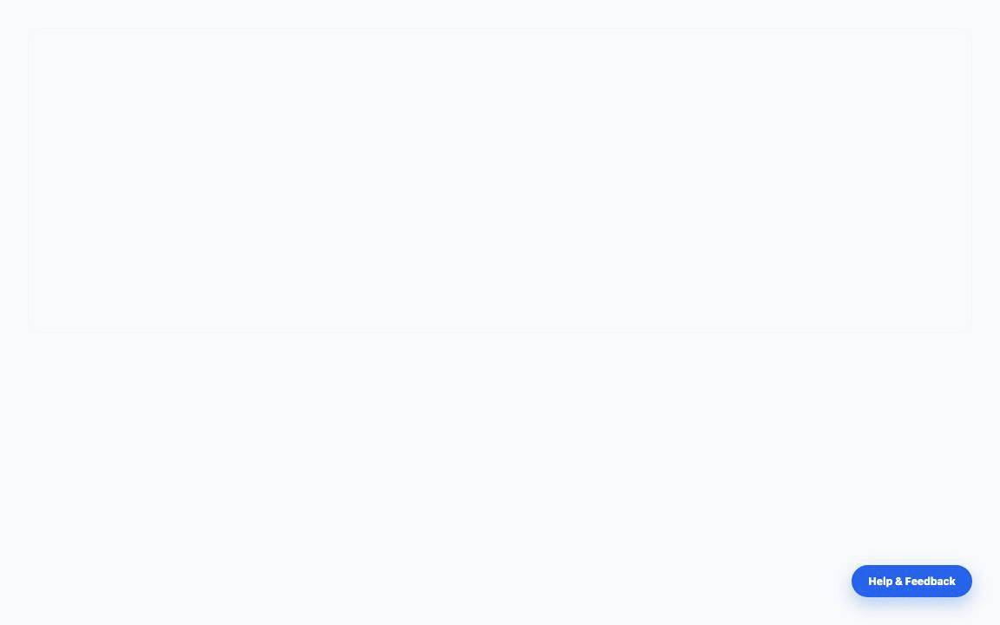

# @reactkits.dev/react-engage

A lightweight, reskinnable, embeddable React component package for user engagement: feedback widgets, bug reporting with auto-telemetry, feature suggestions, newsletter subscriptions, broadcasts, FAQs, and support ticketing.

<p align="center">
  
</p>

## Features and Workflows

### 1. Embedded Floating Widget (`EngageWidget`)
- **Newsletter Subscription**: Direct email signup tab with confirmation feedback.
- **Feature Suggestions**: Users can submit ideas, view existing requests, and vote.
- **Bug Reporting**: Auto-captures browser context, route URL, OS, viewport size, and timestamp for effortless debugging.
- **Support Tickets and FAQs**: Embedded FAQ search and support ticket creation.
- **My Tickets**: Signed-in users can review their own bug reports, suggestions, support requests, and current statuses.

### 2. In-App Management Panel (`EngageAdminPanel`)
- **Support Inbox**: Split view to inspect bug reports with auto-captured metadata (URL, browser, OS, screen resolution) and reply via email.
- **Audience & Newsletters**: Send and track product announcements & newsletter emails.
- **Email Templates**: Edit welcome emails, ticket reply templates, and broadcast newsletters.

---

## Installation

```bash
npm install @reactkits.dev/react-engage lucide-react
```

## Quick Start

Import the widget and styles near your application root:

```tsx
import { EngageWidget } from '@reactkits.dev/react-engage';
import '@reactkits.dev/react-engage/styles.css';

export default function App() {
  return (
    <EngageWidget
      appId="my-app"
      position="bottom-right"
      theme="inherit"
      endpointUrl="/api/engage"
      user={session?.user}
      content={{
        launcher: { title: 'Help Center' },
        faq: {
          items: [
            {
              id: 'getting-started',
              question: 'How do I get started?',
              answer: 'Create your first project from the dashboard.',
              category: 'Getting Started',
              externalUrl: '/docs/getting-started',
            },
          ],
        },
        newsletter: {
          subscribeDescription: 'Get product release notes by email.',
        },
      }}
    />
  );
}
```

## Host-owned content

`react-engage` owns interaction and presentation; the host application owns its
product help and language. Pass a partial `content` object to customize any
end-user string. Overrides are deep-merged with product-neutral defaults, so an
app may replace one label or the complete catalog.

The typed `EngageWidgetContent` contract covers:

- launcher, drawer accessibility labels, and navigation tabs
- FAQ items, search, empty state, categories, and article links
- bug, suggestion, and support form labels, placeholders, validation, success,
  payload fallback titles, option labels, and buttons
- ticket list labels, loading/errors, empty states, and reply text
- newsletter form, confirmation states, frequency options, and actions

Dynamic values use named tokens where documented by the default content:
`{path}`, `{browser}`, `{os}`, and `{email}`. `faqs` and the flat `labels` prop
remain supported for compatibility; new integrations should prefer `content`.

```tsx
import type { EngageWidgetContentOverrides } from '@reactkits.dev/react-engage';

export const engageContent = {
  tabs: { faq: 'Guides' },
  feedback: {
    summaryPlaceholders: {
      bug: 'e.g. The invoice preview is blank',
    },
  },
} satisfies EngageWidgetContentOverrides;
```

If help articles come from a CMS, fetch them in the host application and pass
the resulting array as `content.faq.items`. The package does not impose a CMS or
store domain documentation in its own database.

## Core Exports

- `EngageWidget`: Floating engagement widget for users.
- `EngageAdminPanel`: In-app admin dashboard for managing broadcasts, subscribers, and feedback.
- `@reactkits.dev/react-engage/server`: Next.js route handler factory (`createEngageRouteHandler`).

`EngageAdminPanel` also accepts host-owned `initialTemplates` and
`initialBroadcastSubject`. Server notification identity remains configurable
through `adminEmail`, `senderEmail`, and `senderName` on
`createEngageRouteHandler`. Its `emailContent` option accepts host renderers for
welcome, admin-notification, and newsletter-broadcast emails, so no product
identity or email copy needs to live in the reusable server package.

The `My Tickets` endpoint is authenticated by the host application. Configure
`resolveRequestUser` on `createEngageRouteHandler` and return the current user's
email. Set `isAdmin` for users who may access the admin lists and actions.

## Theme Support

Supports `inherit`, `system`, `light`, and `dark` modes with semantic tokens (`--card-bg`, `--card-border`, `--accent`, `--foreground`, `--muted`).

## Mobile & Positioning Customization

To clear host mobile navigation bars or customize placement:

```tsx
<EngageWidget
  appId="my-app"
  position="bottom-right"
  offsetBottom="80px"     // Elevates launcher above mobile bottom nav bars
  mobileCollapse={true}   // Automatically collapses to circular icon on screens <= 640px
/>
```
