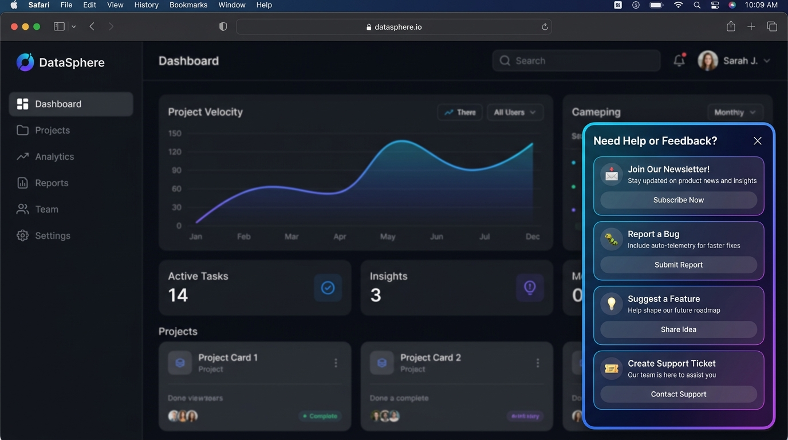
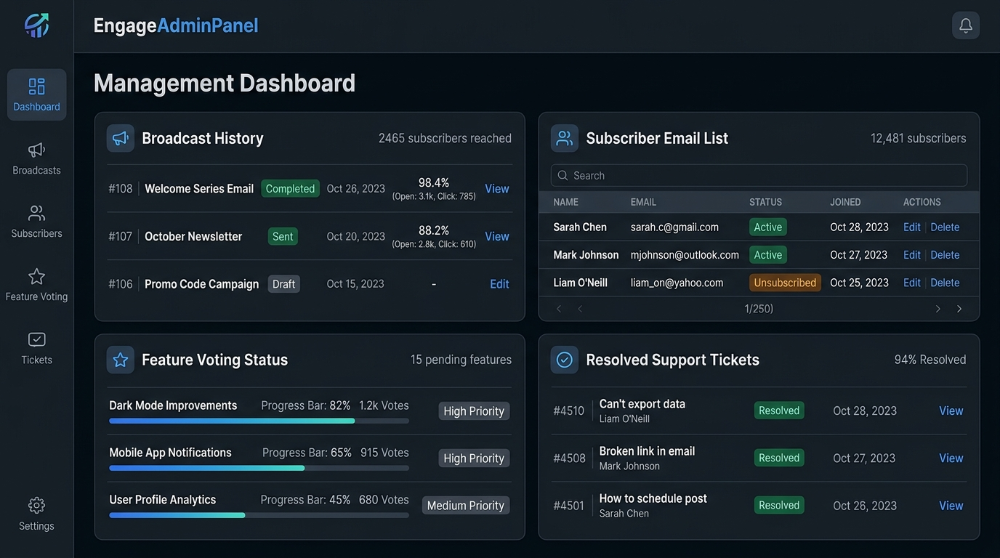

# @reactkits.dev/react-engage

A lightweight, reskinnable, embeddable React component package for user engagement: feedback widgets, bug reporting with auto-telemetry, feature suggestions, newsletter subscriptions, broadcasts, FAQs, and support ticketing.

<p align="center">
  
</p>

## Features & Workflows

### 1. Embedded Floating Widget (`EngageWidget`)
- **📬 Newsletter Subscription**: Direct email signup tab with confirmation feedback.
- **💡 Feature Suggestions**: Users can submit ideas, view existing requests, and vote.
- **🐛 Bug Reporting**: Auto-captures browser context, route URL, OS, viewport size, and timestamp for effortless debugging.
- **🎫 Support Tickets & FAQs**: Embedded FAQ search and support ticket creation.

<p align="center">
  
</p>

### 2. In-App Management Panel (`EngageAdminPanel`)
- **Broadcast Manager**: Send and track product announcements & newsletter emails.
- **Subscriber List**: Search, view, and manage email subscribers.
- **Feature Roadmap & Voting**: Prioritize feature requests based on community upvotes.
- **Support Queue**: Track, assign, and resolve support tickets and bug telemetry.

---

## Installation

```bash
npm install @reactkits.dev/react-engage lucide-react
```

## Quick Start

Import the widget and styles near your application root:

```tsx
import { EngageWidget } from '@reactkits.dev/react-engage';
import '@reactkits.dev/react-engage/styles.css';

export default function App() {
  return (
    <EngageWidget
      appId="my-app"
      position="bottom-right"
      theme="inherit"
      endpointUrl="/api/engage"
    />
  );
}
```

## Core Exports

- `EngageWidget`: Floating engagement widget for users.
- `EngageAdminPanel`: In-app admin dashboard for managing broadcasts, subscribers, and feedback.
- `@reactkits.dev/react-engage/server`: Plug-and-play route handlers (`createFetchHandler`, `createExpressHandler`).

## Theme Support

Supports `inherit`, `system`, `light`, and `dark` modes with semantic tokens (`--card-bg`, `--card-border`, `--accent`, `--foreground`, `--muted`).
